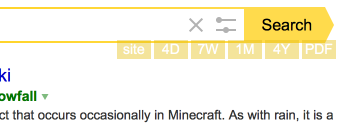
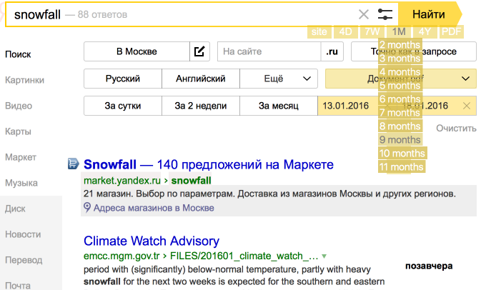

### Yandex Extra Buttons

Для [поисковика Яндекс](http://yandex.ru) на странице результатов поиска добавлены группы кнопок - выбор за последний интервал времени (дни, недели, месяцы, годы), выбор по типам документов или поиск по сайту из списка запомненных в настройках.

* (Fx, Chrome, Opera12, Safari)*

Аналогичный скрипт для Гугла - [Google Search Extra Buttons](https://greasyfork.org/en/scripts/7543/). Оба скрипта пользуются общими сохранёнными настройками на внешнем сайте и имеют почти одинаковые функции - если смотреть в одном браузере, то настройки передаются между сайтами поисковиков при открывании новой страницы.

* выбор языка интерфейса (en, ru, ua, fr, de, es) и сохранение в настройках;
* искать за последние 1,2..13 дней;
* искать за последние 1,2..10 недель;
* искать за последние 1,2..11 месяцев;
* искать за последние 1,2..10 лет;
* искать по нескольким выбранным типам документов (комбинации из 10 типов);
* поиск по сайту из списка сайтов; список запоминается в настройках и редактируется;
* режим более или менее подробного списка интервалов дат.

Выбор интервала в каждой группе сохраняется в настройках для удобства следующего выбора того же интервала (в заголовке списка).

В отличие от Яндекса, Гугл может искать ещё с точностью до часа - в скрипте для Яндекса поиска по часам нет.

Поиск по диапазону дат, по языку документа, по географическому региону - выполняется с помощью интерфейса Яндекса, возникающего также под строкой поиска после нажатия кнопки расширенного поиска в поисковой строке.

Работает на различных доменах Яндекса: [.ru](http://yandex.ru), [.com](http://yandex.com), [.ua](http://yandex.ua), [.by](http://yandex.by) (белорусский), [.kz](http://yandex.kz) (казахский), [.com.tr](http://yandex.com.tr) (турецкий).

#### Вместе со скриптом можно использовать стили:

* [yandex-no-float-field](https://userstyles.org/styles/51117/) - устранение прилипающей к верху экрана строки поиска;
* [yandex-remove-ads](https://userstyles.org/styles/121827/) - удаление несущественной информации с многочисленных страниц сайта;
* [yandex-two-columns](https://userstyles.org/styles/57878/) - результаты поиска - на 2 или более колонок.

Примеры страниц: ["пар"](https://yandex.ru/search/?text=%D0%BF%D0%B0%D1%80), ["engine" (.com)](https://yandex.com/search/?text=engine), ["Сяброўскія" (белор.)](https://yandex.by/search/?text=Сяброўскія).

* Гитхаб - https://github.com/spmbt/haPages/tree/gh-pages/userscript/yandex
* Хостинг - https://greasyfork.org/en/scripts/16332-yandex-extra-buttons

#### Скриншоты: 

